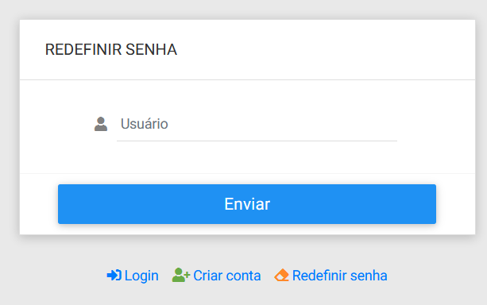

# Changelog do Fork do Template do Adianti 7.1

Informações sobre o Adianti e seu criado veja  [pagina principal](../README.md)

## 1 - Script para MySQL
O script sql do banco de permissões foi alterado para o MySQL 
Na pasta [`template/app/database/database_mysql/`](https://github.com/bjverde/adianti-template/tree/master/template/app/database/database_mysql) tem 3 arquivos

1. permission.mwb - arquivo do MER no formato do [MySQL Workbench 6.3 CE](https://www.mysql.com/products/workbench/)
1. permission.pdf - arquivo do MER no formato PDF
1. permission_mysql.sql -arquivo SQL

## 2 - Inclusão do link para o Login
Nas telas de criar conta e redefiniar senha não tinha um link para voltar para o login

## 3 - Botão limpar pesquisa
Inclusão do botão de limpar pesquisa nas telas
* Adm > Programas
* Adm > Grupos
* Adm > Unidades
* Adm > Usuários

## 4 - Coluna com o nome classe do Programa
Inclusão da coluna com o nome da Classe de controle nas telas

* edição de Usuários
* edição de Grupos

## 5 - O Temas customizado

O tema padrão é o theme3_v4 para o template. 

Informações e alterações veja

https://github.com/bjverde/adianti-theme/blob/master/documents/template/bootstrap_theme3_v4.md