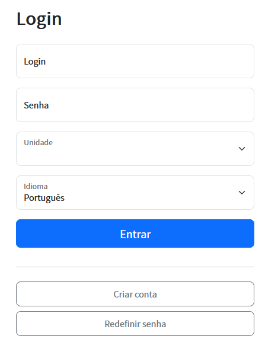
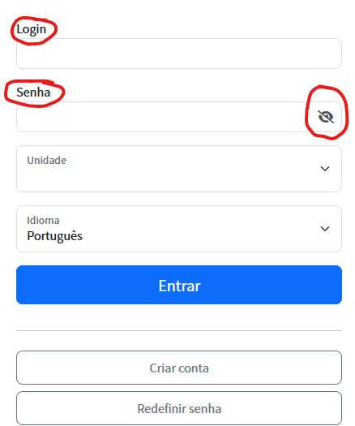

# Sobre Adianti
Informações sobre o Adianti e seu criador veja  [pagina principal](../README.md)

# Changelog do Adianti Fork Template v8.0.0.0

## Principais alterações

### 1 - Temas melhorados

### 2 - Inclusão do link para o Login

### 3 - Habilitando Toggle Visibility do campo senha
Tela normal de login

Tela fork de login
* label sobre o campo
* desativando placeholder
* habilitanto Toggle Visibility

## ChangeLog por issue
* :hammer: [#61 - v 8.0.0.1 - Habilitar olho na senha](https://github.com/bjverde/adianti-fork-template/issues/61)

# ChangeLog versões antigas
* [Changelog do Fork do Template do Adianti v7.6.0](changelog_fork_v7.6.0.md)
* [Changelog do Fork do Template do Adianti v7.5.1](changelog_fork_v7.5.1.md)
* [Changelog do Fork do Template do Adianti v7.3.0](changelog_fork_v7.3.0.md)