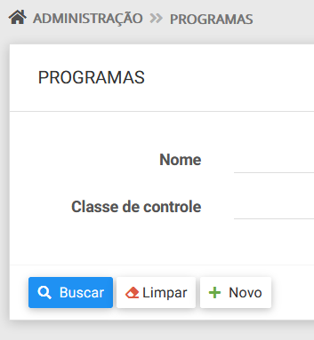

# Sobre Adianti
* Informações sobre o Adianti e seu criador veja  [pagina principal](../README.md)
* [Lista de todas as mudanças](changelog_fork.md)

# Changelog do Fork do Template do Adianti v7.5.1b3

[Para baixar a versão v7.6.0.4](https://github.com/bjverde/adianti-fork-template/releases/tag/v7.6.0.4)

## Principais alterações
### 1 - Alterado modo de criptografia da senha
No Adianti Template 7.5.1 por padrão as senhas dos usuários são gravadas no banco de dados com uma criptografia MD5. Porém essa é uma pratica não recomendada. Para melhorar isso foi alterado para password_hash 

Para voltar para o padrão MD5 altere 
* SystemUser::passwordVerify descomentando a linhda MD5 e comentando password_verify
* SystemUser::getHashPassword descomentando a linhda MD5 e comentando password_verify

### 2 - Botão limpar pesquisa
Inclusão do botão de limpar pesquisa nas telas
* Adm > Programas
* Adm > Grupos
* Adm > Unidades
* Adm > Usuários

### 3 - Coluna com o nome classe do Programa
Inclusão da coluna com o nome da Classe de controle nas telas

* edição de Usuários
* edição de Grupos

### 4 - Temas melhorados 
Os temas theme3 e theme4 foram substituidos algumas melhorias

* theme3 foi alterado para [theme3_v5, alterações do thema](https://github.com/bjverde/adianti-theme/blob/master/documents/template/bootstrap_theme3_v5.md)
* theme4 foi alterado para [theme4_v5, alterações do thema](https://github.com/bjverde/adianti-theme/blob/master/documents/template/material_theme4_v5.md)

## ChangeLog por issue
* template/.gitignore - arquivo diferente do original
* :bug: - [#44 Bug AdiantiFileHashGeneratorService](https://github.com/bjverde/adianti-fork-template/issues/44)
* 🔨- [#43 update composer](https://github.com/bjverde/adianti-fork-template/issues/43)
* 🔨- [#42 Atualizar theme4 para theme4_v5](https://github.com/bjverde/adianti-fork-template/issues/42)
* 🔨- [#41 Atualizar theme3 para theme3_v5](https://github.com/bjverde/adianti-fork-template/issues/41)
* 🔨- [#40 inclusão da coluna nome da classe](https://github.com/bjverde/adianti-fork-template/issues/40)
* 🔨- [#39 Alterar modo da senha de MD5 para password_hash](https://github.com/bjverde/adianti-fork-template/issues/39)
* 🔨- [#38 Incluir o botão de limpar pesquisa](https://github.com/bjverde/adianti-fork-template/issues/38)
* 🔨- [#37 Update dompdf from 2.0.3](https://github.com/bjverde/adianti-fork-template/issues/37)
* 🔨- [#34 Update firebase/php-jwt from 6.0](https://github.com/bjverde/adianti-fork-template/issues/34)

# [Changelog do Fork do Template do Adianti v7.3.0](changelog_fork_v7.3.0.md)