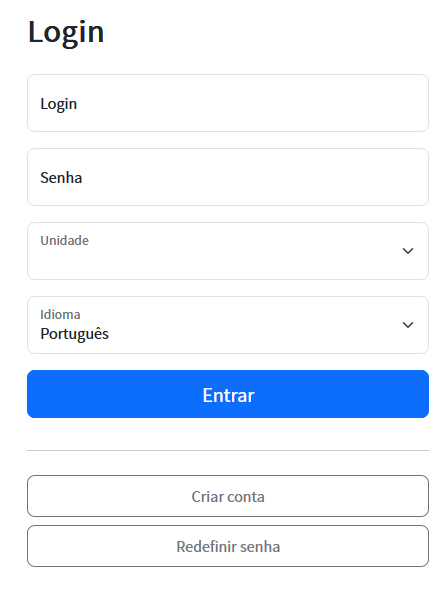
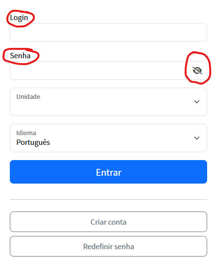
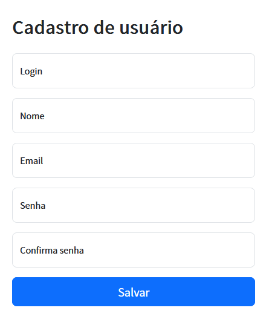
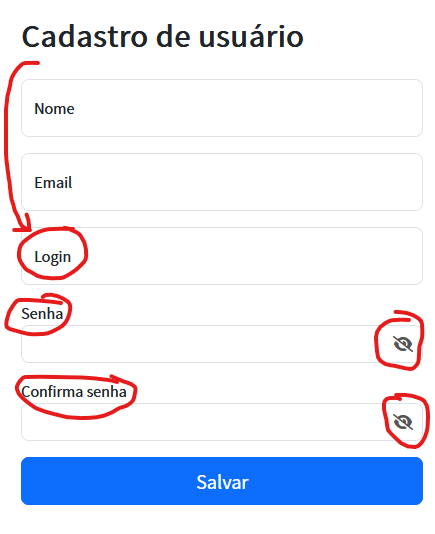

# Sobre Adianti
Informações sobre o Adianti e seu criador veja  [pagina principal](../README.md)

# Changelog do Adianti Fork Template v8.2.0

## Principais alterações

### 1 - Tema melhorado
Instlado tema adminbs5_v4, que é uma versão melhorada do tema adminbs5. [Veja as mudanças no projeto adianti-theme](https://github.com/bjverde/adianti-theme/blob/master/documents/template/adminbs5_v4.md)
1. Zoom no celular, com movimento de pinça
1. Houver no grid com amarelo
1. Possibilitar selecionar label do campo
1. Incluir barra sobre titulo
1. Incluir versão do sistema

### 2 - Habilitando Toggle Visibility do campo senha
Tela normal de login

Tela fork de login
* label sobre o campo
* desativando placeholder
* habilitanto Toggle Visibility

Tela cria conta normal

Tela fork cria conta normal
* campo login posição alterada
* campo senha e confirmação - desativando placeholder
* campo senha e confirmação - habilitanto Toggle Visibility

## ChangeLog por issue
* :hammer: [Habilitar olho na senha](https://github.com/bjverde/adianti-fork-template/issues/69)
* :hammer: [Atualizar adminbs5 para adminbs5_v4](https://github.com/bjverde/adianti-fork-template/issues/70)
* :hammer: [Instalar o FormDin v5.4.4](https://github.com/bjverde/adianti-fork-template/issues/71)

# ChangeLog versões antigas
* [Changelog do Fork do Template do Adianti v8.0.0](changelog_fork_v8.1.0.md)
* [Changelog do Fork do Template do Adianti v8.0.0](changelog_fork_v8.0.0.md)
* [Changelog do Fork do Template do Adianti v7.6.0](changelog_fork_v7.6.0.md)
* [Changelog do Fork do Template do Adianti v7.5.1](changelog_fork_v7.5.1.md)
* [Changelog do Fork do Template do Adianti v7.3.0](changelog_fork_v7.3.0.md)